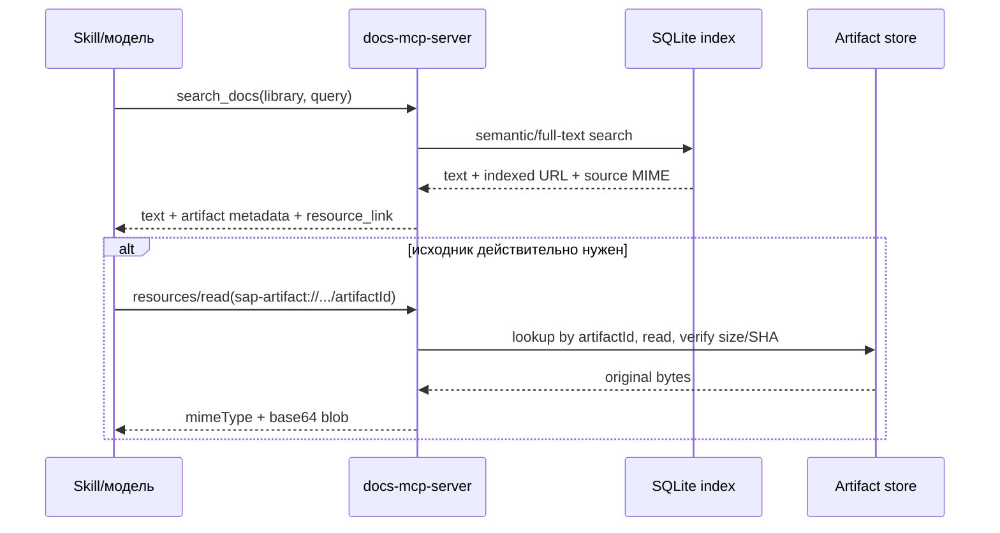

# SAP Process Navigator: поиск по тексту и выдача исходных артефактов через MCP

Дата исследования: 2026-08-18.

## Вывод

SAP-набор нельзя загружать в Grounded Docs простым обходом каталога или ZIP. Такой
обход пропустит часть BPMN и Office-файлов без расширения, проиндексирует служебные
манифесты и захватит три лишних файла, которых нет в манифестах.

Рекомендуемая архитектура состоит из двух связанных слоёв:

1. **Поисковый слой** хранит извлечённый текст и сгенерированные карточки процессов.
   Он работает через существующий `search_docs`.
2. **Слой исходников** хранит неизменённые BPMN, DOCX, XLSX, PDF и TXT вне SQLite.
   Каждый источник получает стабильный `artifactId`. Результат поиска возвращает
   `resource_link`, а отдельный `resources/read` лениво возвращает точные байты
   выбранного файла как base64 `blob`.

Не следует включать бинарные данные непосредственно в каждый результат поиска.
Это раздувает ответы, засоряет контекст модели и передаёт файлы, которые не нужны
для текущего вопроса.

Для первой версии предлагается библиотека `sap_process_navigator` с неизменяемой
SemVer-версией `2025.1.0`. Исходный выпуск SAP сохраняется отдельно под меткой
`2025-FPS1-RU`: Grounded Docs принимает `X.Y.Z`, но не принимает эту метку как
версию библиотеки. Имя можно изменить до загрузки, но библиотека, версия и
`artifactId` должны оставаться стабильными после индексации.

До приёмки версию `2025.1.0` можно пересобирать. После приёмки она не меняется:
исправление импортёра, каталога или поисковых представлений публикуется как
`2025.1.1` с прежней меткой Source Release `2025-FPS1-RU`.

## Зафиксированный порядок реализации

Работа выполняется в три последовательных этапа. Следующий этап не начинается,
пока предыдущий не принят.

### Этап 1. Загрузка и индексация библиотеки

1. В `sap-library-mcp` построить набор для загрузки только по каноническим
   записям `manifest.json`. Общий формат Artifact Catalog определяется в
   `docs-mcp-server`, а SAP-специфичная сборка остаётся в SAP-репозитории.
2. Сохранить байты всех загружаемых файлов без изменений. Файлам Office без
   расширения назначить на сервере проверенные расширения `.docx` и `.xlsx`, а
   исходное имя сохранить в Artifact Catalog.
3. Подготовить 192 Process Cards, полный текст Description, DOCX и PDF,
   смысловые представления BPMN и metadata-only представления XLSX. Сырой BPMN
   XML и содержимое ячеек XLSX в индекс не помещать.
4. Полностью проверить пакет локально, загрузить во временный каталог
   действующего сервера Grounded Docs и повторно проверить количество файлов,
   размеры и SHA-256.
5. После серверной проверки атомарно переместить пакет в окончательный каталог.
   Индексация из временного или частично загруженного каталога запрещена.
6. Создать и проиндексировать библиотеку `sap_process_navigator@2025.1.0` с
   Source Release `2025-FPS1-RU`. При сбое до приёмки версию можно очистить и
   пересобрать под тем же номером.
7. Принять этап только после проверки всех 192 процессов, 1 004 записей Artifact
   Catalog, 950 доступных файлов, 54 недоступных записей, 16 исправленных
   расширений и представлений всех 950 доступных файлов: 192 Description, 382
   смысловых BPMN, 175 DOCX, 26 PDF и 175 metadata-only XLSX.
8. Выполнить 15 английских контрольных Search Query: по три для Description,
   BPMN, DOCX, PDF и метаданных XLSX. Подтвердить качество поиска до изменения
   MCP.

### Этап 2. Выдача Source Artifacts через MCP

1. Добавить к Search Results две группы Artifact References с именем, типом и
   доступностью: Matched Artifacts, чьи поисковые представления дали результат,
   и остальные Related Artifacts того же процесса.
2. Сохранить существующий текстовый контракт `search_docs` и добавить к нему
   структурированные `matchedArtifacts`, `relatedArtifacts` и `resource_link`.
3. Возвращать все Matched Artifacts после удаления повторов и не более 50
   Related Artifacts на ответ. При превышении ставить признак `truncated`.
4. Добавить стандартные MCP `resource_link` и чтение ресурса.
5. Добавить read-only инструменты `list_source_artifacts` для полного перечня
   файлов процесса и `get_source_artifact(artifactId)` для точных байтов файла.
6. Ограничить один возвращаемый Source Artifact десятью мегабайтами по умолчанию
   и разрешить изменять предел конфигурацией. Метаданные более крупного файла
   остаются доступны.
7. Подключить Artifact Catalog и каталог Source Artifacts к MCP-контейнеру в
   режиме только для чтения.
8. Не добавлять отдельные права на библиотеки или Source Artifacts. Действующая
   бинарная модель Grounded Docs остаётся общей: подключённый к MCP клиент имеет
   доступ ко всем его библиотекам. Скилл управляет порядком вызовов, но не
   является механизмом авторизации.
9. Перед выдачей каждого файла проверять размер и SHA-256. При несовпадении не
   возвращать файл, сохранить текстовый Search Result и сообщить об ошибке
   целостности.
10. Проверить, что Codex читает файл и сохраняет точную копию с тем же SHA-256.

### Этап 3. Скилл и сквозная проверка

1. Создать полноценный скилл для поиска по библиотеке, выбора Matched и Related
   Artifacts и получения нужного Source Artifact.
2. По модели действующего `lib-nifi` преобразовывать русский вопрос в Search
   Query с точными английскими терминами официальной документации и формировать
   ответ пользователю на русском. Не добавлять машинный перевод в индекс.
3. Выполнить 15 русских пользовательских сценариев, соответствующих английским
   контрольным Search Query первого этапа. Проверить маршрутизацию, текстовые
   ответы, перечни файлов, чтение каждого поддержанного формата и сохранение
   точной копии.
4. Принять скилл только после сквозного теста в реальном Codex.

## Что находится в исходном наборе

Источники находятся в репозитории
`/home/as/ai-projects/sap-library-mcp` на коммите
`3624f96ff1004362be7e507fb2905eaaa358f603`.

Основное дерево:

```text
/home/as/ai-projects/sap-library-mcp/
  SAP Best Practices for SAP S4HANA Cloud Private Edition/
    2025-FPS1/
      RU/
        Line of Business/
          <одна или несколько бизнес-областей>/
            <ID> - <название процесса>/
              description/Description.txt
              diagrams/*.bpmn или *.bpmn2
              accelerators/<группа>/*
              manifest.json
  process_queue.json
  manifest.schema.json
  registry.xlsx
  sap-process-library.zip
```

Назначение файлов подтверждается первичными файлами проекта:

- [описание архитектуры выгрузки](../../../sap-library-mcp/docs/SAP_DOWNLOAD_ARCHITECTURE.md);
- [правила структуры и проверки](../../../sap-library-mcp/docs/DOWNLOAD_GUIDE.md);
- [JSON Schema манифеста](../../../sap-library-mcp/manifest.schema.json);
- [очередь из 192 процессов](../../../sap-library-mcp/process_queue.json).

`registry.xlsx` является производным реестром. Источником истины служат манифесты
и файлы, а не сама таблица.

Текущий `sap-process-library.zip` не отслеживается Git (`git status` показывает
его как untracked). Это пользовательский артефакт, пригодный для read-only
аудита, но его нельзя автоматически считать опубликованным release bundle,
добавлять в коммит или заменять без отдельного решения.

### Проверенные размеры и состав

| Показатель | Значение |
|---|---:|
| Размер дерева по `du -h` | 57 MiB |
| Сумма размеров файлов дерева | 52 597 542 байта |
| ZIP | около 38 MiB сжатых, 52 768 536 байт распакованных |
| Записей в ZIP | 2 087 |
| Процессов / манифестов `Complete` | 192 / 192 |
| Записей об артефактах | 1 004 |
| `Downloaded` | 950 |
| `Missing` | 18 |
| `ExternalUnresolved` | 36 |
| Суммарный размер `Downloaded` | 51 662 486 байт |
| Максимальный отдельный файл | 1 222 167 байт |

Физические файлы процесса:

| Вид | Количество |
|---|---:|
| Description TXT | 192 |
| BPMN всего | 383: 364 `.bpmn2` и 19 `.bpmn` |
| DOCX с расширением | 168 |
| XLSX с расширением | 168 |
| PDF | 26 |
| Office без расширения | 16 |

В манифестах присутствуют только 382 BPMN. Ровно три физических файла не имеют
ссылки ни из одного манифеста, все находятся в процессе `1BM`:

```text
diagrams/BPMN.bpmn2
accelerators/_/1BM_S4HANA2025-FPS1_BPD_EN_RU.docx
accelerators/_/1BM_S4HANA2025-FPS1_BPD_EN_RU.xlsx
```

Полный валидатор проекта сейчас сообщает `ALL_PASS` для 192 манифестов и итог
`1004 = 950 + 18 + 36`, но эти три лишних файла он не считает ошибкой. Поэтому
импорт должен идти по `manifest.json[].artifacts[].relative_path`, а не через
слепое перечисление дерева.

### Проверка ценности BPMN и XLSX для поиска

Содержимое BPMN нельзя считать полным дублем Description и DOCX. В 382
канонических BPMN для 174 процессов после удаления повторов внутри процесса
обнаружены следующие смысловые подписи:

| Элемент | Всего | Точной фразы нет в Description и DOCX |
|---|---:|---:|
| Задачи | 2 669 | 1 440 (54%) |
| Дорожки и роли | 596 | 159 (27%) |
| Подписанные переходы | 242 | 148 (61%) |
| События | 722 | 605 (84%) |
| Шлюзы | 103 | 92 (89%) |

У всех 174 процессов с BPMN есть хотя бы одна отсутствующая точная подпись;
медиана составляет восемь таких подписей на процесс. Кроме того, у 17 процессов
нет DOCX вообще: им соответствуют 66 BPMN, и без смыслового представления этих
диаграмм поиск будет опираться только на краткий Description и другие редкие
материалы. Сырой XML индексировать не нужно, но исключение BPMN из поискового
слоя потеряет запросы по конкретным задачам, ролям, событиям и развилкам.

XLSX имеет другой профиль. Все 167 файлов с расширением и восемь подтверждённых
XLSX без расширения образуют пары с DOCX и содержат один лист `Test Cases` для
ручной загрузки тестового сценария в SAP Cloud ALM. Формул нет; структура состоит
из 21 колонки от `Test Case GUID` до `Action Expected Result`. Содержательные
колонки почти полностью повторяют DOCX:

| Колонка XLSX | Доля токенов, уже присутствующих в DOCX |
|---|---:|
| Activity Title | 99,83% |
| Action Title | 99,45% |
| Action Instructions | 99,94% |
| Action Expected Result | 99,88% |

Остаток состоит преимущественно из GUID, полей Cloud ALM, служебных заголовков и
редких расхождений экспорта. Индексация содержимого XLSX создаст почти полные
дубли и добавит технический шум. Достаточно индексировать его метаданные:
процесс, имя, формат и назначение `Test script (SAP Cloud ALM)`. Сам файл остаётся
Source Artifact и доступен через Artifact Reference.

## Что Grounded Docs умеет сейчас

### Индексация

Grounded Docs уже умеет читать локальные каталоги и архивы. Для каждого файла
он определяет MIME, выбирает pipeline, преобразует содержимое в текст и сохраняет
чанки. DOCX, XLSX и PDF проходят через Xberg и становятся Markdown:

- [PipelineFactory](../../src/scraper/pipelines/PipelineFactory.ts);
- [DocumentPipeline](../../src/scraper/pipelines/DocumentPipeline.ts);
- [LocalFileStrategy](../../src/scraper/strategies/LocalFileStrategy.ts);
- [поддерживаемые форматы](../concepts/supported-formats.md).

Но SAP-набор выявляет два пробела:

1. Пакет `mime` возвращает `null` для `.bpmn` и `.bpmn2`; они превращаются в
   `application/octet-stream` и ни один pipeline их не принимает.
2. Для 16 Office-файлов без расширения также получается
   `application/octet-stream`. `DocumentPipeline` умеет уточнять тип только по
   расширению URL, поэтому эти файлы тоже остаются без текста.

Для обычных файлов манифест содержит пригодные `mime`, `size_bytes`, `sha256` и
`relative_path`. Однако у всех 16 файлов без расширения manifest MIME равен
`application/octet-stream`; проверка сигнатуры определяет среди них 8 Word OOXML
и 8 Excel OOXML. Поэтому импорт должен быть manifest-driven по составу и SHA, а
effective MIME для этих 16 записей обязан дополнительно подтверждаться по
структуре OOXML-контейнера. В каталоге полезно хранить оба значения:
`manifestMime` и проверенный `effectiveMime`.

Без подготовительного importer обычный обход сможет извлечь текст только из
552 из 950 канонических исходников: 192 Description и 360 manifest-backed
DOCX/XLSX/PDF с расширениями. Он пропустит 382 BPMN и 16 Office без расширения,
то есть 398 исходников (41,9%). Одновременно в поиск попадут 192 служебных
манифеста, `registry.xlsx` и две лишние Office-копии процесса `1BM`.

### Хранение и поиск

SQLite хранит:

- URL и исходный/обработанный MIME на уровне страницы;
- текстовые чанки, их метаданные и embeddings;
- но **не исходные байты документа**.

Это видно в [типах хранилища](../../src/store/types.ts),
[DocumentRetrieverService](../../src/store/DocumentRetrieverService.ts) и
[описании схемы](../concepts/data-storage.md). `StoreSearchResult` уже возвращает
`url`, `mimeType` и `sourceMimeType`. То есть текущий URL страницы является
готовым seam для сопоставления найденного текста с записью каталога артефактов.

### MCP

Полный сервер уже объявляет capability `resources` и публикует текстовые ресурсы
списков библиотек/версий. Однако `search_docs` форматирует все результаты через
`createResponse`, который создаёт только один `text` block:

- [полный MCP-сервер](../../src/mcp/mcpServer.ts);
- [конструкторы текстовых ответов](../../src/mcp/utils.ts).

Минимальный сервер для `.mcpb` ещё уже: он объявляет только `tools` и предоставляет
`search_docs`, `list_libraries`, `find_version`; ресурсов в нём нет:

- [read-only MCP-сервер](../../src/mcp/readOnlyMcpServer.ts);
- [точка входа MCPB](../../src/mcpb.ts).

Это не ограничение SDK. В проекте установлен официальный
`@modelcontextprotocol/sdk` 1.29.0, который поддерживает MCP 2025-11-25,
`ResourceLink`, `EmbeddedResource` и `BlobResourceContents`
([package.json](../../package.json), [package-lock.json](../../package-lock.json)).

## Что разрешает MCP

Спецификация MCP 2025-11-25 прямо поддерживает нужную схему:

- resource имеет URI, имя, MIME и необязательный размер;
- `resources/read` может вернуть текст либо base64 `blob`;
- результат tool может содержать `resource_link` на такой resource;
- tool может также вернуть embedded resource, включая бинарный blob.

Первичные источники:

- [MCP 2025-11-25: Resources](https://modelcontextprotocol.io/specification/2025-11-25/server/resources);
- [MCP 2025-11-25: Tools / Resource Links](https://modelcontextprotocol.io/specification/2025-11-25/server/tools#resource-links);
- [официальное руководство TypeScript SDK по resources](https://github.com/modelcontextprotocol/typescript-sdk/blob/main/docs/servers/resources.md);
- [официальное руководство TypeScript SDK по tool results](https://github.com/modelcontextprotocol/typescript-sdk/blob/main/docs/servers/tools.md).

Правильная последовательность выглядит так:



MCP resource передаёт байты клиенту, но протокол не заставляет конкретный host
сохранить их как файл на диск или показать кнопку Download. Ресурс предназначен
прежде всего для чтения и добавления в контекст. Например, официальная
[документация Claude Code](https://code.claude.com/docs/en/mcp#use-mcp-resources)
говорит, что MCP resources можно выбирать через `@` и они добавляются как
attachments, но это не является общим обещанием всех MCP-клиентов.

Следовательно, нужно отдельно проверить Claude Desktop, Claude Code и другие
целевые клиенты. Если человеку нужен именно скачиваемый файл, позже потребуется
host-specific UI или отдельный авторизованный HTTP download endpoint. Это не
следует смешивать с первой MCP-реализацией.

## Рекомендуемая модель данных

Исходники не нужно помещать в SQLite BLOB. Их следует хранить в неизменяемом
архиве или read-only каталоге. Рядом нужен каталог, построенный только из
проверенных манифестов.

Минимальная запись каталога:

```json
{
  "artifactId": "art_<opaque-stable-id>",
  "library": "sap_process_navigator",
  "version": "2025.1.0",
  "sourceRelease": "2025-FPS1-RU",
  "solutionId": "EARL_SolS-055",
  "processId": "2XU",
  "processName": "Procurement of Materials with Variant Configuration",
  "lineOfBusiness": ["R&D/Engineering", "Sourcing and Procurement"],
  "type": "Accelerator",
  "group": "Implementation",
  "name": "Test script",
  "status": "Downloaded",
  "mimeType": "application/vnd.openxmlformats-officedocument.wordprocessingml.document",
  "size": 126011,
  "sha256": "...",
  "storageKey": "<opaque archive entry>",
  "indexedUrl": "file:///.../index-entry.docx"
}
```

`artifactId` должен обозначать конкретное вхождение файла в процесс, а не только
SHA. Один и тот же бинарный файл может законно встречаться в нескольких процессах.
Практичный стабильный ID — хеш от `library + version + processId + relative_path +
sha256`. Клиент не должен передавать серверный путь.

Статусы `Missing` и `ExternalUnresolved` тоже входят в каталог и в поисковые
карточки, но для них не создаётся readable resource. Это позволяет навыку честно
ответить, что SAP не предоставил файл, вместо выдачи пустышки.

## Рекомендуемый формат пакета

Текущий `sap-process-library.zip` нельзя считать готовым индексным пакетом:

- он содержит три неописанных файла;
- расширения BPMN не распознаются;
- 16 Office-файлов не имеют расширений;
- `manifest.json` и служебная структура сами попадут в поиск;
- текст Office/PDF не содержит достаточно явной связи с ID процесса и LOB.

Следует собирать производный, воспроизводимый release bundle:

```text
sap-process-navigator-2025-FPS1-RU/
  source.zip                 # точные исходные байты; только manifest Downloaded
  artifact-catalog.json      # 1004 записи, включая Missing/ExternalUnresolved
  index.zip                  # данные только для Grounded Docs
    processes/<ID>.md        # карточка процесса + описание + список артефактов
    artifacts/<artifactId>.* # индексируемое представление/копия
  checksums.sha256
  build-report.json
```

Требования к `index.zip`:

1. Создавать его только из 192 валидных манифестов.
2. Добавлять карточку каждого процесса с solution/version/region, LOB, ID,
   названием, Description и списком всех артефактов/статусов.
3. Для BPMN использовать MIME `application/xml` и индексное имя `.xml`, сохраняя
   оригинальные байты и имя только в `source.zip`.
4. Office без расширения давать корректное индексное расширение только после
   проверки OOXML ZIP-структуры (8 DOCX и 8 XLSX в текущем наборе). Исходное имя
   и `manifestMime=application/octet-stream` остаются в каталоге, точные байты —
   в `source.zip`.
5. DOCX/XLSX/PDF отдавать существующему `DocumentPipeline` для извлечения текста.
6. Не индексировать JSON манифесты, реестр и внутренний каталог как обычные
   документы.
7. Связывать каждый индексный URL с `artifactId` через `artifact-catalog.json`.
8. Проверять число записей, размер и SHA исходника до публикации пакета.

`registry.xlsx` можно оформить как отдельный collection-level artifact. При этом
он остаётся производным отчётом и не подменяет 192 манифеста.

Альтернатива — научить `LocalFileStrategy` понимать manifest-driven artifact
bundle и передавать MIME из каталога непосредственно в pipeline. Это избавит от
части копий в `index.zip`, но сильнее меняет общий ingest. Для первой поставки
отдельный воспроизводимый index bundle проще проверить и откатить.

## MCP-контракт

### Поиск

`search_docs` должен сохранить обычный текстовый ответ для совместимости, но
добавлять:

- `structuredContent` с process/artifact metadata;
- уникальные `resource_link` только для найденных `Downloaded` artifacts;
- `mimeType`, `size`, отображаемое имя и описание;
- URI вида
  `sap-artifact://sap_process_navigator/2025.1.0/<artifactId>`.

Пример результата:

```json
{
  "content": [
    {"type": "text", "text": "Найдено описание и фрагмент test script..."},
    {
      "type": "resource_link",
      "uri": "sap-artifact://sap_process_navigator/2025.1.0/art_...",
      "name": "2XU_S4HANA2025-FPS1_BPD_EN_RU.docx",
      "description": "2XU / Implementation / Test script",
      "mimeType": "application/vnd.openxmlformats-officedocument.wordprocessingml.document",
      "size": 126011
    }
  ],
  "structuredContent": {
    "results": [
      {
        "processId": "2XU",
        "artifactIds": ["art_..."]
      }
    ]
  }
}
```

Resource link не обязан присутствовать в глобальном `resources/list`; это прямо
разрешает спецификация. Для 1 004 элементов не стоит раздувать общий список.
Достаточно объявить resource template и возвращать ссылки из поиска/карточки
процесса.

### Чтение исходника

`resources/read` для artifact URI должен:

1. разобрать только допустимую схему URI;
2. найти запись по `artifactId`, не принимая путь от клиента;
3. проверить библиотеку, версию, статус и права пользователя;
4. прочитать только allowlisted `storageKey`;
5. повторно проверить размер и SHA-256;
6. вернуть точные байты как base64 `blob` с оригинальным MIME.

Даже XML/TXT лучше отдавать как `blob`, если обещается именно исходник: так
сохраняются BOM, переводы строк и точное побайтовое содержимое. Текстовая
нормализация остаётся только в поисковом слое.

Для клиентов, которые не умеют переходить по `resource_link`, можно добавить
read-only tool `get_source_artifact(artifactId)`. Он возвращает тот же источник
как embedded resource. Это совместимый fallback, а не основной путь.

## Размеры и ограничения

Base64 увеличивает объём примерно на треть. Самый большой текущий файл
1 222 167 байт превратится примерно в 1 629 556 символов base64. Отдельная выдача
такого файла реалистична; выдача всех 51,7 MB источников одним ответом — нет.

В `resources/read` нет отдельного стандартного range/chunk API. Поэтому серверу
нужны собственные ограничения:

- один artifact на read;
- configurable `maxArtifactBytes`;
- timeout и rate limit;
- отказ с явным размером, если файл выше лимита;
- никакой автоматической передачи source blob из `search_docs`.

Для текущего набора достаточно лимита 2 MiB. Для будущих библиотек безопаснее
сделать значение конфигурируемым и до повышения проверить ограничения reverse
proxy и клиентов.

## Развёртывание

Стандартный distributed Compose сейчас монтирует `docs-mcp-data` только worker,
а MCP-контейнер получает лишь config volume
([docker-compose.yml](../../docker-compose.yml)). Поэтому handler ресурса в MCP
не сможет прочитать файл, лежащий только у worker.

Рекомендуется отдельный read-only artifact volume:

```text
docs-mcp-artifacts:/artifacts:ro
```

Его должны видеть worker/importer и MCP coordinator; web — только если появится
пользовательская кнопка скачивания. Альтернатива — `readArtifact` через worker
tRPC, но тогда base64 проходит лишний сетевой и JSON-слой. Для нынешнего одного
сервера shared read-only volume проще и надёжнее.

Принятая версия хранится на сервере в распакованном виде:

```text
/artifacts/sap_process_navigator/2025.1.0/
  artifact-catalog.json
  source/
  checksums.sha256
  build-report.json
```

Архив поставки хранится отдельно для переноса и восстановления. Runtime не
читает отдельные Source Artifacts непосредственно из ZIP. После приёмки каталог
версии и поисковый индекс неизменяемы и сохраняются без срока автоматического
удаления. Удаление выполняется только отдельной административной операцией для
явно указанной библиотеки и версии; MCP не получает инструмент удаления.

Первая публикация выполняется на действующем сервере Grounded Docs после полного
локального PASS. Отдельный тестовый сервер не требуется, поскольку создаётся
новая библиотека и существующие библиотеки не изменяются.

Локальный `.mcpb` сейчас читает только локальную SQLite. Он не сможет вернуть
серверный source archive без отдельной доставки архива или без перехода на
удалённый read-only endpoint. Не следует молча включать 38 MiB приватных SAP
материалов в каждый платформенный `.mcpb`. Это отдельное решение по поставке.

## Безопасность

Спецификация MCP требует валидировать resource URI, проверять доступ и корректно
кодировать binary data. Для этой библиотеки обязательны дополнительные правила:

- URI содержит opaque ID, а не абсолютный путь;
- `realpath`/archive-entry проверяются относительно одного allowlisted root;
- запрещены `..`, symlink escape и произвольный `file://` от клиента;
- выдаются только записи `Downloaded`, подтверждённые манифестом;
- размер и SHA проверяются при каждой выдаче либо через доверенный immutable
  storage с проверкой при публикации;
- полный набор не публикуется в открытый HTTP/object storage;
- отдельные права на библиотеки и Source Artifacts не вводятся: действующая
  бинарная граница доступа MCP применяется ко всей поверхности сервера;
- логи содержат artifact ID и результат, но не binary data, токены или приватные
  download URL;
- tool annotations остаются `readOnlyHint: true`, без `fetch_url`, Chromium и
  любых write-tools.

Официальные требования: [MCP Resources, Security Considerations](https://modelcontextprotocol.io/specification/2025-11-25/server/resources#security-considerations)
и [пример безопасной проверки file-backed resource в TypeScript SDK](https://github.com/modelcontextprotocol/typescript-sdk/blob/main/docs/servers/resources.md#serve-files-without-path-traversal).

## Рассмотренные варианты

| Вариант | Плюсы | Проблемы | Решение |
|---|---|---|---|
| Положить binary в SQLite | Один backup | Резкий рост БД, миграция, копирование в worker/MCP, binary не нужен поиску | Не использовать |
| Встраивать blob в каждый search result | Простая модель вызова | +33% base64, контекст, повторения, плохая latency | Не использовать |
| Возвращать только серверный `file://` | Почти нет кода | Удалённый клиент не видит FS, раскрывается путь, нет access boundary | Не использовать |
| Отдать обычный HTTPS URL | Удобно браузеру | Auth/срок жизни ссылки, URL может утечь, MCP host не обязан скачивать | Только как будущий UI |
| `resource_link` + lazy `resources/read` | Нативный MCP, точные байты, read-only, платим только по запросу | Нужны catalog/storage и client tests | **Рекомендуется** |
| Embedded resource из `get_source_artifact` | Предсказуемый явный вызов в Codex | Большой tool result, client-dependent | Использовать вместе с resource link |

## Предлагаемые этапы реализации

1. **Импортёр пакета.** Проверить 192 манифеста, построить catalog/source/index,
   исключить три orphan-файла, доказать counts и SHA.
2. **Поисковая приёмка.** Загрузить `index.zip`, проверить 15 английских Search
   Query по ID процесса, LOB, Description, смысловым BPMN, DOCX, PDF,
   metadata-only XLSX и статусам Missing.
3. **ArtifactRepository.** Read-only lookup по opaque ID и чтение из immutable
   shared volume с size/SHA validation.
4. **MCP resource template.** Добавить resource capability и handler в полном и
   минимальном read-only сервере.
5. **Связь с поиском.** По `StoreSearchResult.url` находить catalog record и
   добавлять deduplicated `resource_link` + structured metadata.
6. **Read-only tools.** Добавить `list_source_artifacts` и
   `get_source_artifact` вместе со стандартным `resource_link`.
7. **Codex acceptance.** Доказать в реальном Codex, что link виден, файл читается
   только по запросу, MIME/size/SHA совпадают и предел 10 МБ соблюдается.
8. **Skill.** После стабилизации контракта научить скилл преобразовывать русский
   вопрос в английский Search Query, выбирать нужный artifact и запрашивать
   source только по необходимости; выполнить 15 русских сквозных сценариев.

## Критерии приёмки

- Импорт использует ровно 192 манифеста и 1 004 artifact records.
- Доступны ровно 950 исходников; Missing/ExternalUnresolved не имеют blob.
- Три orphan-файла `1BM` не попадают ни в индекс, ни в source release.
- Индексируются смысловые представления 382 manifest-backed BPMN, полный текст
  192 Description, 175 DOCX и 26 PDF, а также метаданные 175 XLSX. Сырой BPMN
  XML и содержимое ячеек XLSX не индексируются.
- Первый этап проходит 15 английских контрольных Search Query; скилл проходит
  соответствующие 15 русских сквозных сценариев.
- Поиск по процессу возвращает текст и правильные artifact IDs без binary payload.
- `resources/read` возвращает bytes, MIME, size и SHA, совпадающие с манифестом.
- Запрос чужого/несуществующего ID, path traversal и artifact не в статусе
  Downloaded отклоняются.
- MCP сохраняет полностью read-only поверхность; `fetch_url` и browser tools не
  появляются.
- Ни один исходник не записывается в SQLite и не попадает в логи.
- Distributed deployment работает при раздельных worker и MCP контейнерах.
- Поведение подтверждено в реальном Codex, а не только через SDK test client.
